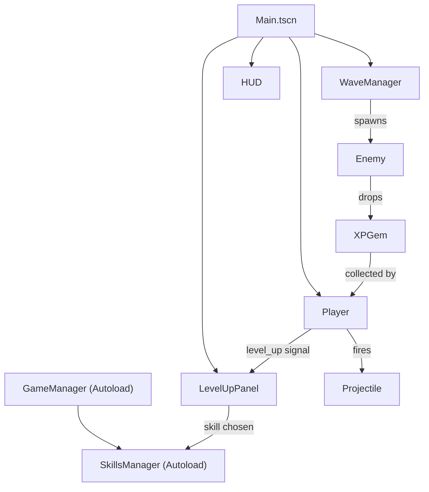

# BulletHeaven — Master Implementation Plan

> **Baseline snapshot** taken 2026-03-07. This document is the single source of truth for where the project stands and what remains to be built.

---

## 1. Current State (Baseline)

**Engine:** Godot 4.4 · **Language:** GDScript · **Window:** 1280×720

### Architecture



### Autoloads
| Singleton | File | Role |
|---|---|---|
| `GameManager` | `Components/game_manager.gd` | Score, XP/level math, `level_up` signal |
| `SkillsManager` | `Components/skills_manager.gd` | Skill catalog, stat modifiers |

### Scene Tree (`Main.tscn`)
| Node | Type | Script |
|---|---|---|
| Main | Node2D | `main.gd` — camera follow |
| Camera2D | Camera2D | — |
| Player | CharacterBody2D | `player.gd` — move, auto-fire, magnet, HP |
| WaveManager | Node | `wave_manager.gd` — wave spawning |
| HUD | CanvasLayer | `hud.gd` — score/HP/XP/level display |
| LevelUpPanel | CanvasLayer | `level_up_panel.gd` — 3-choice skill picker |

### What Works
- WASD movement (200 px/s)
- Auto-fire at nearest enemy (0.5s interval, skill-modified)
- Projectiles (400 px/s, 10 dmg, 2s lifetime)
- Enemy chase AI (80 px/s, 20 HP, contact damage)
- XP gems with magnet pull (60px radius, upgradeable)
- Level-up at `level * 10` XP → pause → 3 random skills
- 5 skills: Damage Up, Speed Boost, Rapid Fire, Multi Shot, Magnet Range
- Wave spawning (400–600px from player, count scales with wave)
- HUD: score label, HP bar, XP bar, level label
- Collision layers: Player=1, Enemy=2, Projectile=4, XPGem=8

### File Map
```
BulletHeaven/
├── project.godot
├── icon.svg                    # only art asset
├── Components/
│   ├── game_manager.gd
│   ├── skills_manager.gd
│   └── wave_manager.gd
├── Entities/
│   ├── Player/   (Player.tscn + player.gd)
│   ├── Enemy/    (Enemy.tscn + enemy.gd)
│   ├── Projectile/ (Projectile.tscn + projectile.gd)
│   └── XPGem/    (XPGem.tscn + xp_gem.gd)
├── Scenes/       (Main.tscn + main.gd)
└── UI/           (HUD.tscn + hud.gd, LevelUpPanel.tscn + level_up_panel.gd)
```

### Key Numbers
| Stat | Value |
|---|---|
| Player base speed | 200 px/s |
| Player max HP | 100 |
| Base fire rate | 0.5s |
| Projectile speed / dmg / lifetime | 400 px/s / 10 / 2.0s |
| Enemy HP / speed | 20 / 80 px/s |
| XP gem value | 1 |
| Magnet radius | 60 px |
| Spawn distance | 400–600 px |
| XP to level | `level * 10` |

---

## 2. Gaps (Prioritized)

### 🔴 Critical
- [x] **Game Over** — no death state; HP can reach 0 with no effect
- [x] **Art Assets** — all entities are `_draw()` placeholders (colored rectangles/circles)

### 🟡 Medium
- [x] **Title / Main Menu** — game starts immediately
- [ ] **Audio** — no BGM, no SFX
- [ ] **Background** — no tilemap, parallax, or ground
- [ ] **HUD Styling** — default Godot theme, no visual polish

### 🟢 Nice-to-Have
- [ ] Enemy variety (ranged, tank, swarm)
- [ ] Weapon variety (orbiting, area, piercing)
- [ ] Deeper skill tree (new abilities, not just stat boosts)
- [ ] Juice (screen shake, particles, hit flash, death explosions)
- [ ] Pause menu
- [ ] High-score persistence

---

## 3. Proposed Build Order

> To be filled in once a direction is chosen. Phases below are a suggested skeleton.

### Phase 1 — Playable Loop (COMPLETE)
1. Game-over screen + restart
2. Generate & wire up sprite art for player, enemies, projectiles, XP gems

### Phase 2 — Presentation & Depth (IN PROGRESS)
1. Main Menu / Title screen
2. Sound Effects synthesis (Shoot, Hit, Level Up)
3. AudioManager singleton
4. Pause Menu overlay
4. Background (tilemap or parallax)
5. HUD visual polish + themed UI

### Phase 3 — Depth
6. 2–3 new enemy types
7. New weapon / ability types
8. Deeper skill tree

### Phase 4 — Polish
9. SFX + music
10. Particles, screen shake, hit feedback
11. Pause menu, high scores

---

## 4. Verification Plan

- Run project in Godot editor after each phase
- Confirm no crash on player death → game-over → restart loop
- Visual check that sprites render correctly
- Playtest 5+ waves to verify balance
